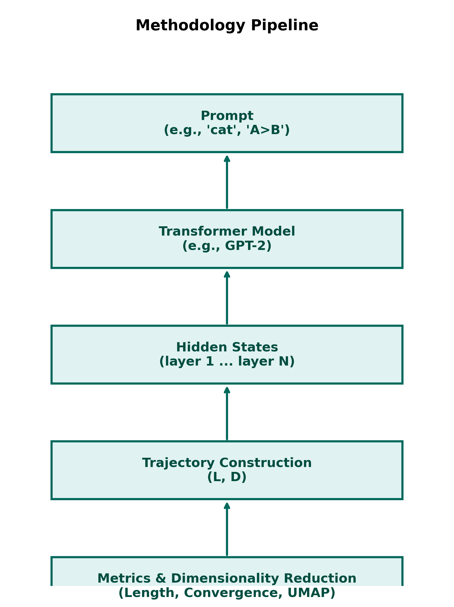
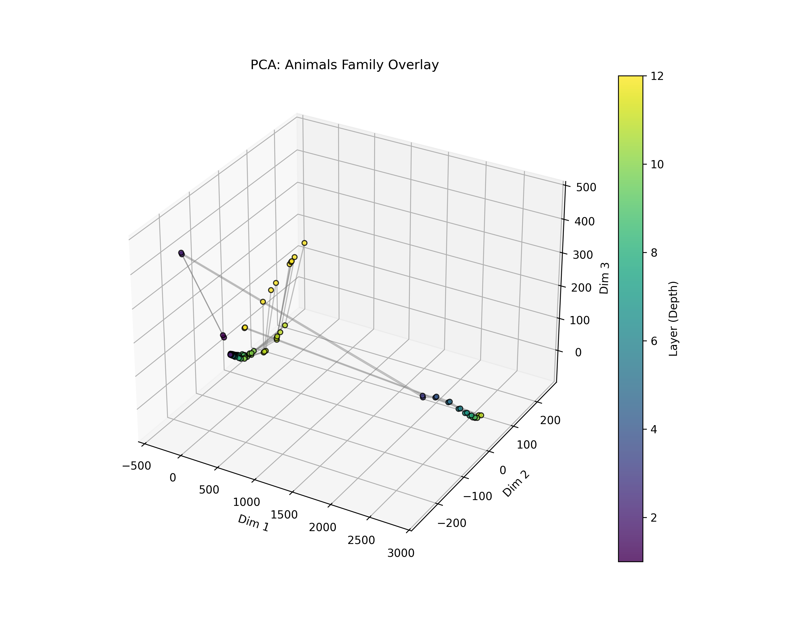
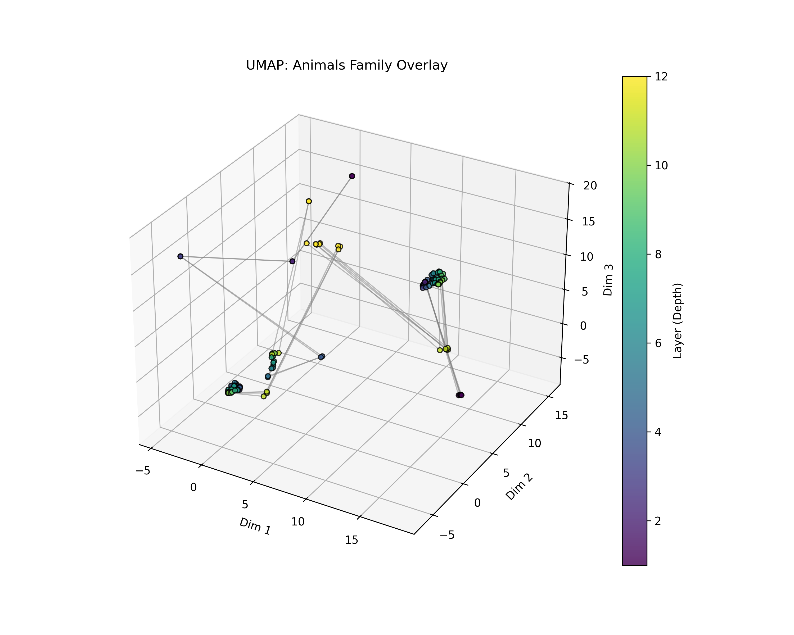
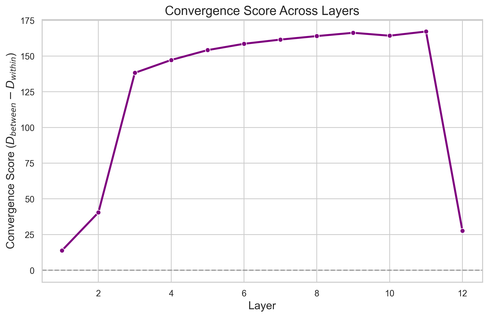
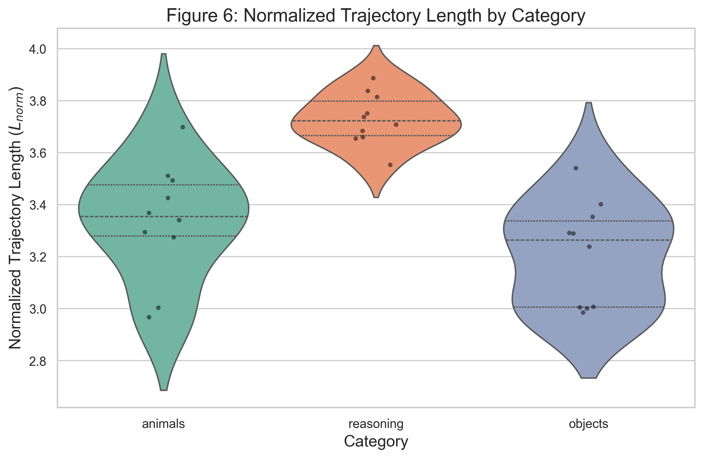
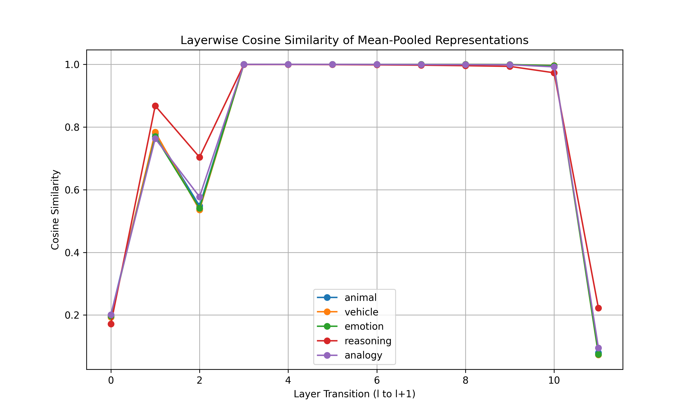

# Trajectory Geometry of Transformer Representations Across Layers

<div align="center">
  
  <p><em>Figure 1: Latent state trajectories evolving across the layers of a transformer network.</em></p>
</div>

## Introduction: A Computational Neuroscience Perspective

This repository investigates the geometry of transformer representations across layers, applying a highly rigorous, computationally-driven analytical framework. While this work focuses on artificial neural networks, we draw heavy inspiration from **computational neuroscience** to understand how hidden states evolve dynamically.

Rather than viewing transformers as static input-output mappings, we treat the forward pass as a **population trajectory** moving through a high-dimensional state space. Specifically, we investigate whether hidden-state evolution exhibits structures analogous to:

- **Neural Manifolds**: Do transformer hidden states organize into low-dimensional manifolds that govern computation?
- **Attractor Dynamics**: Do representations of semantically related concepts converge toward stable attractor states deeper in the network?
- **Population Trajectories**: Can layer-by-layer transitions be mapped and analyzed structurally as non-random geometric paths?
- **Representational Geometry**: Can the distance and curvature of these trajectories reveal reasoning, disambiguation, and semantic clustering that is invisible when looking at individual activations alone?

*Note: This framing serves as an analytical lens. We explicitly avoid claims that LLMs implement biological cognition; rather, we demonstrate that tools from neuroscience reveal profound, non-random structural organization in artificial representations.*

---

## Key Findings & Visualizations

We provide an open-source pipeline for extracting, analyzing, and statistically validating these trajectories across models like GPT-2, TinyLlama, and Qwen2.5. 

### 1. Methodology & Pipeline

<div align="center">
  
  <p><em>Figure 2: Our systematic pipeline: From hidden state extraction across layers, to high-dimensional metric computation, rigorous dimensionality reduction, and statistical validation.</em></p>
</div>

### 2. Neural Manifolds & Semantic Convergence

Through Representational Similarity Analysis (RSA) and rigorously controlled Dimensionality Reduction (global PCA and UMAP), we observe that prompts within the same semantic category (e.g., "Animals") start dispersed but converge into tight, distinct regions of the latent space.

<div align="center">
  
  
  <p><em>Figure 3: Global PCA (Left) and UMAP (Right) projections showing how representations belonging to the 'Animals' category evolve across layers. The trajectories demonstrate structured flow rather than random walks.</em></p>
</div>

### 3. Quantitative Geometry: Convergence Index & Trajectory Length

We move beyond visual plots by employing quantitative, high-dimensional metrics. 
- **Convergence Index:** Measures $D_{between}(l) - D_{within}(l)$. We observe a sharp statistical increase in convergence in the middle-to-late layers.
- **Trajectory Length:** Measures the $L_2$ distance traveled across the latent space. We find that structured reasoning tasks travel significantly longer, more curved paths compared to basic semantic lookups.

<div align="center">
  
  
  <p><em>Figure 4: (Left) The Trajectory Convergence Index across layers, showing 95% Bootstrap Confidence Intervals. (Right) Total Trajectory Length grouped by semantic category.</em></p>
</div>

### 4. Layerwise Similarity Dynamics

The geometric similarity between adjacent layers reveals the rate of representational change. We consistently observe initial rapid transformation, followed by a stabilization phase, and a final recalibration before the output head.

<div align="center">
  
  <p><em>Figure 5: Cosine similarity between adjacent layers, illustrating the phase transitions of information processing within the network.</em></p>
</div>

---

## Collaborator Quick Start Guide

This section is for collaborating researchers to set up the environment, run the pipeline, and interpret the outputs.

### Environment Setup

The dependencies strictly follow standard ML data science libraries to ensure cross-platform reproducibility.

```bash
# Clone the repository
git clone <repo_url>
cd <repo_directory>

# Create a virtual environment
python3 -m venv venv
source venv/bin/activate

# Install dependencies
pip install -r requirements.txt

# For MP4/GIF animations, ensure ffmpeg is installed:
# sudo apt-get install -y ffmpeg
```

### Running the Pipeline

The architecture is built on a strict 3-layer separation: `src/` (core logic), `scripts/` (execution), and `notebooks/` (analysis).

1. **Dataset Generation:** The fixed JSONL dataset guarantees streaming compatibility.
   ```bash
   python scripts/generate_prompts.py
   ```
2. **Hidden State Extraction:** Extracts representations across all tokens and layers.
   ```bash
   python scripts/extract_hidden_states.py --model gpt2
   ```
3. **Metric Calculation:** Computes Convergence, Length, and Curvature in high-dimensional space.
   ```bash
   python scripts/convergence_analysis.py
   ```
4. **Statistical Validation:** Generates the rigorous tests (Mann-Whitney U, Permutation tests).
   ```bash
   python scripts/run_statistics.py
   ```

All raw outputs, statistical CSVs, and generated plots are saved deterministically to the `results/` and `figures/` directories.

---

## Repository Structure

*   `docs/`: Research specifications, experiment matrices, and theoretical framing.
*   `src/`: Pure library logic, metric computation (returns NumPy arrays), and statistical validation.
*   `data/`: Datasets and stored hidden state tensors (`.pt` files) with Parquet metadata.
*   `notebooks/`: Thin Jupyter notebooks exclusively for EDA, loading saved data, and visualization.
*   `scripts/`: Linear bash and Python scripts for pipeline execution.
*   `tests/`: `pytest` suite for core modules. Run with `PYTHONPATH=. python3 -m pytest tests/`.

## Documentation
*   **[Research Specification](docs/research_spec.md)**: Outlines the motivation, models, metrics, and required controls.
*   **[Experiment Matrix](docs/experiment_matrix.md)**: The systematic matrix of planned hypotheses vs. controls.