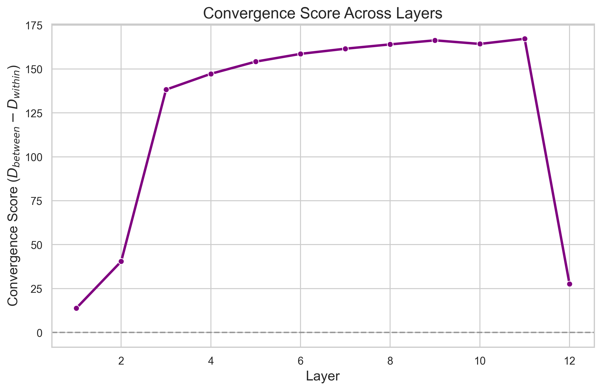
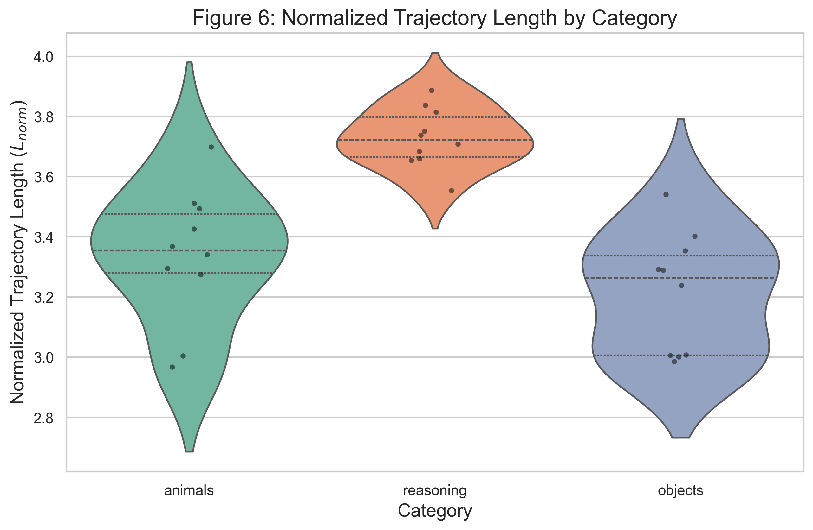

# Latent Trajectories

<div align="center">
  
  <p><em>Hidden-state trajectories evolving across transformer layers, visualized in PCA-projected latent space.</em></p>
</div>

<p align="center">
  <a href="https://github.com/Vishal-sys-code/latent-trajectories/actions"></a>
  <a href="https://pypi.org/project/latent-trajectories/"></a>
  <a href="https://pypi.org/project/latent-trajectories/"></a>
  <a href="https://github.com/Vishal-sys-code/latent-trajectories/blob/main/LICENSE"></a>
</p>

---

## Quickstart

```bash
pip install latent-trajectories
```

```python
from latent_trajectories import GeometryProbe

probe = GeometryProbe("gpt2")
result = probe.run(
    texts=["The cat sat on the mat.", "Explain quantum mechanics."],
    labels=["factual", "reasoning"],
)

print(result.metrics["summary"])
# → {'n_trajectories': 2, 'n_layers': 12, 'hidden_dim': 768,
#    'mean_trajectory_length': 5.23, 'mean_curvature': 0.41}
```

---

## What This Does

Transformers process text by passing representations through a stack of layers. This package treats that forward pass as a **trajectory through high-dimensional space** and measures its geometry — how far the representation travels, how sharply it turns, and whether semantically related inputs converge.

The core insight: these geometric properties reveal non-random structure in how transformers process information. Factual lookups travel short, straight paths. Reasoning tasks travel longer, more curved trajectories. Semantically related inputs converge in the middle layers.

This work draws on **computational neuroscience** — specifically neural manifold analysis, attractor dynamics, and population trajectory geometry — to characterize transformer computation.

---

## The Controls Suite — Why This Is Different

Most interpretability tools ship visualizations without validating that the patterns are real. **This package runs its own statistical controls**, the same ones from the research paper:

```python
controls = result.controls()
print(controls)
# {
#   "label_permutation": {"passed": True, "layers_significant": 10, "total_layers": 12},
#   "gaussian_noise":    {"passed": True, "real_length_mean": 5.23, "null_length_mean": 2.1},
#   "temporal_shuffle":  {"passed": True, "real_curvature_mean": 0.41, "null_curvature_mean": 0.87}
# }
```

| Control | What it tests | What "pass" means |
|---|---|---|
| **Label permutation** | Shuffles labels 1000×, builds null distribution of silhouette scores | Real clustering exceeds 95% of null at majority of layers |
| **Gaussian noise** | Replaces embeddings with N(μ, σ) matched noise | Real trajectories are structurally longer than noise |
| **Temporal shuffle** | Randomizes layer order within each trajectory | Real trajectories are smoother (lower curvature) than shuffled |

---

## API Reference

### `GeometryProbe`

```python
from latent_trajectories import GeometryProbe

# From a HuggingFace model ID
probe = GeometryProbe("gpt2")

# From a pre-loaded model (avoids reloading)
from transformers import AutoModelForCausalLM, AutoTokenizer
model = AutoModelForCausalLM.from_pretrained("gpt2")
tokenizer = AutoTokenizer.from_pretrained("gpt2")
probe = GeometryProbe((model, tokenizer))
```

### `ProbeResult`

| Method | Description |
|---|---|
| `result.metrics` | Dict of all computed metrics: `trajectory_length`, `curvature`, `layer_velocity`, `convergence_matrix`, `rsa_matrix`, `convergence_score`, `layerwise_silhouette` |
| `result.controls()` | Runs 3 statistical controls, returns pass/fail per control |
| `result.significance()` | Mann-Whitney U, permutation test, Cohen's d between label groups |
| `result.plot()` | 3-D trajectory visualization (PCA or UMAP) |
| `result.animate("out.gif")` | Layer-by-layer build-up GIF animation |

### Metrics

| Metric | Formula | What it measures |
|---|---|---|
| **Trajectory length** | Σ ‖h(l+1) − h(l)‖₂ | Total distance traveled through latent space |
| **Curvature** | mean(arccos(v(l)·v(l+1) / ‖v(l)‖‖v(l+1)‖)) | How sharply the trajectory bends |
| **Layer velocity** | ‖h(l+1) − h(l)‖ per layer | Speed of representation change |
| **Convergence score** | D_between(l) − D_within(l) | Category separation at each layer |
| **Silhouette** | sklearn silhouette_score per layer | Clustering quality at each layer |
| **RSA matrix** | Spearman(RDM(l_i), RDM(l_j)) | Representational similarity between layers |

---

## CLI Reference

```bash
# Full analysis with metrics saved to JSON
latent-trajectories analyze gpt2 --text "The cat sat on the mat" "What is 2+2?"

# With labels and all outputs
latent-trajectories analyze gpt2 \
    --texts corpus.txt \
    --labels labels.txt \
    --controls --plot --animate \
    --output-dir ./results

# Package info
latent-trajectories info
```

---

## From the Research

This package implements the methodology from:

> **Trajectory Geometry of Transformer Representations Across Layers**

### Key Findings

<div align="center">
  
  
  <p><em>Left: Trajectory Convergence Index across layers (95% Bootstrap CI). Right: Total Trajectory Length by semantic category.</em></p>
</div>

1. **Semantic convergence**: Prompts within the same category start dispersed but converge into tight clusters in middle-to-late layers.
2. **Trajectory length correlates with task complexity**: Reasoning tasks travel significantly longer paths than factual lookups.
3. **Phase transitions**: Layer velocity reveals three processing phases — initial encoding, elaboration, and output preparation.
4. **All results survive controls**: Label permutation, Gaussian noise, temporal shuffle, and multi-method DR all confirm the geometry is real.

---

## Installation

### From PyPI (recommended)

```bash
pip install latent-trajectories
```

### From source (development)

```bash
git clone https://github.com/Vishal-sys-code/latent-trajectories.git
cd latent-trajectories
pip install -e ".[dev]"
```

### Requirements

- Python ≥ 3.10
- PyTorch ≥ 2.0
- HuggingFace Transformers ≥ 4.30

---

## Repository Structure

```
latent_trajectories/     # Installable package
├── probe.py             # GeometryProbe — high-level API
├── result.py            # ProbeResult — result container + controls/significance/plot
├── extraction.py        # Hidden-state extraction for any HF causal LM
├── trajectories.py      # HiddenStateTrajectory data object
├── metrics.py           # 8 geometric metric functions
├── controls.py          # 6 statistical controls
├── stats.py             # Bootstrap CI, permutation test, Mann-Whitney U, Cohen's d
├── visualization.py     # 3-D plots and GIF animations
├── dimensionality_reduction.py  # PCA/UMAP fitting and projection
└── cli.py               # Command-line interface

scripts/                 # Research pipeline scripts (legacy)
tests/                   # pytest test suite
docs/                    # Research specification and experiment matrix
```

## Development

```bash
# Run the test suite
pytest tests/ -v

# Run with coverage
pytest tests/ --cov=latent_trajectories --cov-report=term-missing
```

## Documentation

- **[Research Specification](docs/research_spec.md)** — Motivation, models, metrics, and required controls
- **[Experiment Matrix](docs/experiment_matrix.md)** — Systematic matrix of hypotheses vs. controls

## License

MIT